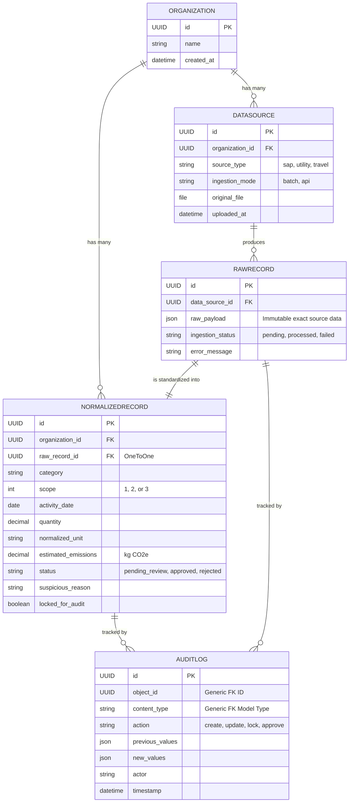

# ESG Data Platform: Domain Model

This document outlines the core domain models used in the ESG Ingestion Prototype. The architecture is designed for multi-tenancy, immutable auditability, and clear separation between raw incoming data and canonical normalized data.

## Entity Relationship Diagram

## Model Descriptions

1. **Organization**: Represents the tenant. All data is scoped to an organization to support SaaS models.
2. **DataSource**: A single ingestion event. If an analyst uploads a CSV with 10,000 rows, there is 1 DataSource.
3. **RawRecord**: The exact, unmodified JSON representation of a single row/payload from the source system. This is crucial for auditability. If normalization logic changes, we can replay from the `RawRecord` without needing the original file.
4. **NormalizedRecord**: The canonical ESG ledger entry. This contains standardized units, categorized scopes, and estimated emissions. It undergoes the analyst review workflow.
5. **AuditLog**: Uses Django's `GenericForeignKey` to attach immutable state change logs to any record in the system, detailing *who* did *what*, *when*, and *how* the state mutated.
